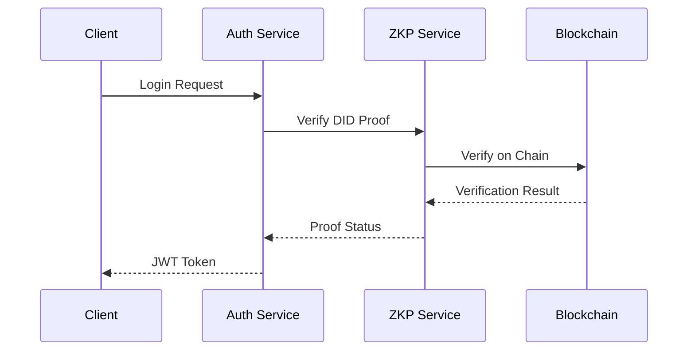
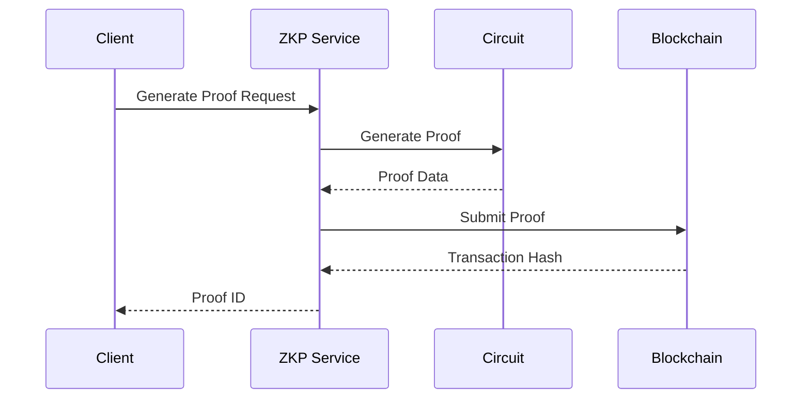

## ZKAuth Architecture

### System Components

1. **Authentication Service**
   - Handles user registration and login
   - Manages JWT tokens
   - Integrates with DID verification

2. **Zero-Knowledge Proof Service**
   - Generates ZK proofs
   - Verifies proofs
   - Manages proof lifecycle
   - Integrates with blockchain verification

3. **Project Service**
   - Manages project CRUD operations
   - Handles API key generation
   - Controls access permissions

4. **Database Layer**
   - SQLite with libSQL
   - Handles data persistence
   - Manages relationships

### Security Architecture

1. **Authentication Flow**


2. **Zero-Knowledge Proof Flow**


### Data Models

1. **User**
```typescript
interface User {
  id: string;
  username: string;
  password: string;
  email?: string;
  did?: string;
  created_at: string;
}
```

2. **Project**
```typescript
interface Project {
  id: string;
  userId: string;
  name: string;
  description?: string;
  environment: 'development' | 'production';
  allowedOrigins: string;
  apiKey: string;
  createdAt: string;
  updatedAt: string;
}
```

3. **Proof**
```typescript
interface ZKProof {
  id: string;
  userId: string;
  challenge: string;
  timestamp: number;
  publicSignals: string[];
  proof: any;
  status: 'pending' | 'verified' | 'failed';
  protocol: string;
  curve: string;
  verifiedAt?: number;
  metadata?: Record<string, any>;
}
```

### Circuit Architecture

1. **Identity Circuit**
   - Verifies DID ownership
   - Uses Groth16 protocol
   - Implemented in Circom

2. **Range Circuit**
   - Verifies value ranges
   - Supports numeric comparisons
   - Uses Plonk protocol

3. **Batch Circuit**
   - Aggregates multiple proofs
   - Optimizes verification costs
   - Supports recursive proofs

### Deployment Architecture

1. **Development**
   - Local SQLite database
   - In-memory proof cache
   - Mock blockchain interactions

2. **Production**
   - Distributed database
   - Redis cache layer
   - Live blockchain integration
   - Load balancer support